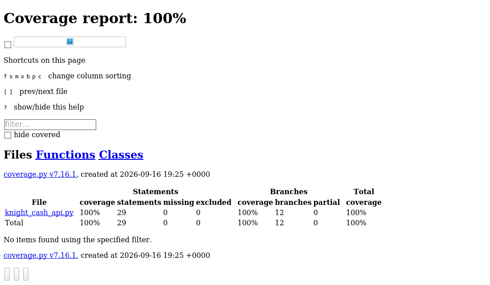

# KnightCash API — Audit Report

## 1. The Bug Log

- **Money-minting via negative amounts** — `POST /transfer` never validated that
  `amount > 0`. Since the handler did `accounts[from] -= amount`, sending a
  negative `amount` (e.g. `-50.00`) *increased* the sender's balance while
  decreasing the receiver's, letting anyone mint funds out of thin air.
  **Fix:** reject any request where `amount <= 0` with `HTTP 400`.

- **Infinite overdraft** — the transfer logic never checked that the sender
  actually had enough money before debiting the account, so any account
  (including a fresh $0.00 balance) could be driven arbitrarily negative.
  **Fix:** compare the requested amount against the sender's current balance
  (rounded to the cent) and return `HTTP 400 "Insufficient funds"` if the
  amount exceeds it.

- **Internal state leakage via unhandled `KeyError`** — both `/balance/{id}`
  and `/transfer` accessed the `accounts` dict directly (`accounts[account_id]`)
  with no existence check. An unknown account ID crashed straight into an
  unhandled `KeyError`, which FastAPI turned into a raw `500` response whose
  body/traceback exposed the internal dict structure and variable names —
  a textbook data-leakage vulnerability (see slide 26, "Data Leakage Tests").
  **Fix:** explicitly check membership in `accounts` first and raise a clean
  `HTTPException(404, "Account not found")` instead of letting the exception
  propagate.

*(A fourth, lower-severity bug was also caught and fixed: floating-point
drift — e.g. `89.995` instead of `89.99` — from unrounded arithmetic on
`float` balances, and a missing check that let a user "transfer" money to
themselves as a silent no-op. Both are covered in the test suite and fixed
in `knight_cash_api.py`.)*

**Red-phase evidence:** running this exact test file against the original,
unpatched `knight_cash_api.py` fails 10 of the 20 tests (negative amounts,
overdrafts, self-transfers, unknown accounts, float drift) — confirming the
tests actually catch the bugs above rather than passing trivially:

```
FAILED test_knight_cash.py::TestGetBalance::test_unknown_account_returns_404_not_500
FAILED test_knight_cash.py::TestGetBalance::test_unknown_account_error_does_not_leak_internals
FAILED test_knight_cash.py::TestTransferNegativeAndBoundary::test_negative_amount_is_rejected
FAILED test_knight_cash.py::TestTransferNegativeAndBoundary::test_zero_amount_is_rejected
FAILED test_knight_cash.py::TestTransferNegativeAndBoundary::test_insufficient_funds_is_rejected
FAILED test_knight_cash.py::TestTransferNegativeAndBoundary::test_transfer_one_cent_over_balance_fails
FAILED test_knight_cash.py::TestTransferNegativeAndBoundary::test_self_transfer_is_rejected
FAILED test_knight_cash.py::TestTransferNegativeAndBoundary::test_unknown_from_account_returns_404
FAILED test_knight_cash.py::TestTransferNegativeAndBoundary::test_unknown_to_account_returns_404
FAILED test_knight_cash.py::TestTransferFloatingPointAndSecurity::test_floating_point_precision_is_rounded
10 failed, 10 passed
```

## 2. Coverage Proof

Final run:

```
Name                 Stmts   Miss Branch BrPart  Cover   Missing
----------------------------------------------------------------
knight_cash_api.py      26      0     12      0   100%
----------------------------------------------------------------
TOTAL                   26      0     12      0   100%
20 passed
```



If your course's submission tool wants a screenshot taken from your own
machine instead of this generated one, just re-run:

```bash
py -m pytest --cov=knight_cash_api --cov-report=html --cov-branch
```

and open `htmlcov/index.html` in a browser.

## 3. Prompt Audit

Exact prompt used in Step 4 to force a test onto a specific missed branch
(the sufficient-funds boundary check):

> "Write a specific Pytest case that will trigger the `if round(req.amount, 2) > round(accounts[req.from_account], 2):` branch in the `/transfer` endpoint — specifically the case where the transfer amount is exactly one cent more than the sender's balance, so it must hit the `insufficient funds` path rather than the happy path."

This produced `test_transfer_one_cent_over_balance_fails`, which pairs with
`test_transfer_exactly_full_balance_succeeds` to cover both the true and
false side of that boundary condition.

## 4. GitHub Link

 **Repository:** https://github.com/Alfonso-mtzj/Test-Driven-Development-Assignment

Containing:
- `knight_cash_api.py` (fixed)
- `test_knight_cash.py` (final suite, 20 tests / 100% branch coverage)
- `htmlcov/` or the screenshot from Section 2
